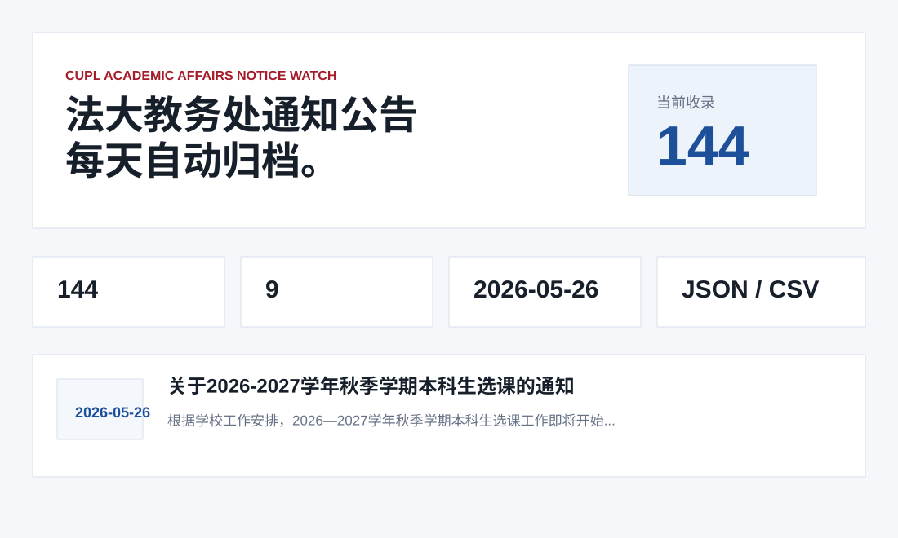
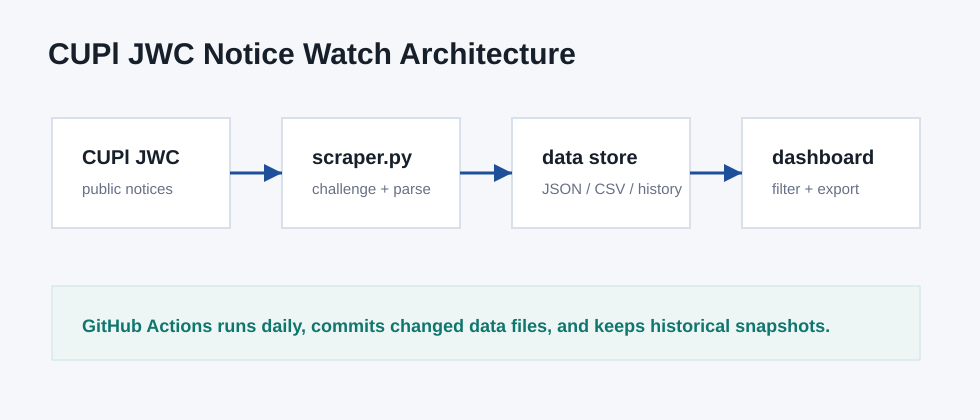

# 法大教务处通知公告观察站

[English README](README.md)

这是一个非官方的中国政法大学教务处通知公告每日归档与看板项目，自动抓取公开网页信息，保留历史记录，并提供可检索的静态前端。



> 免责声明：本项目只归档公开网页信息，与中国政法大学官方无关，不代表官方信息发布。涉及选课、考试、学籍等重要事项，请务必以教务处官网原文为准。

## 目标站点

- 站点：中国政法大学教务处
- 首页：<https://jwc.cupl.edu.cn/>
- 覆盖栏目：教务管理、学籍管理、教学研究、考务管理、实践教学、教材建设、质量监控、教学服务、交流培养

## 功能

- 抓取公告标题、日期、链接、摘要、栏目、来源页面、首次发现时间、最后发现时间
- 处理教务处网站的动态浏览器校验流程
- 保存 `data/notices.json`、`data/notices.csv` 和 `data/history/` 每日快照
- 提供静态前端看板，支持关键词搜索和栏目筛选
- 通过 GitHub Actions 每日自动运行并提交更新后的数据文件

## 快速开始

```bash
python3 scraper.py 2
python3 -m http.server 8080
```

打开：

```text
http://localhost:8080
```

## 数据结构

- `data/notices.json`：合并后的历史公告库
- `data/notices.csv`：适合表格软件打开的导出文件
- `data/meta.json`：更新时间、总量、栏目等元数据
- `data/history/YYYY-MM-DD.json`：每次运行当天抓取到的公告快照

## 架构图



## 定时更新

`.github/workflows/update.yml` 会每天定时运行爬虫，并在数据变化时提交更新。

## 项目说明书

仓库包含 Word 版项目说明书：

```text
docs/project_proposal.docx
```

## License

MIT
